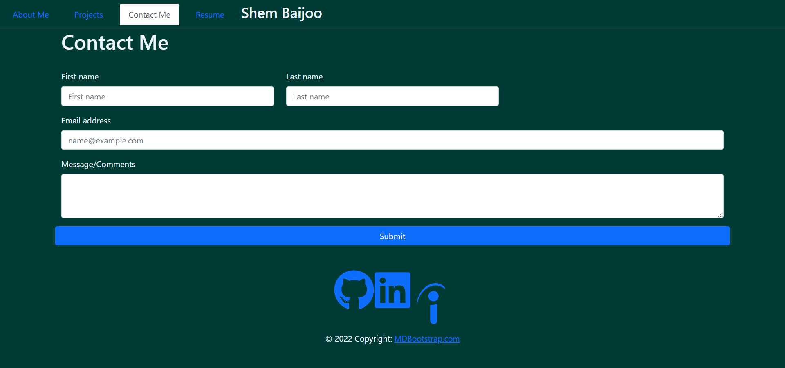

# Shem's Portfolio

## Description

This project is a portfolio that details my personal story, the projects I have worked on, my resume, and a method of contacting me. This project was constructed using React, npm modules such as react-icons, mdbootstrap, fontawesome, and others. The resume portion of this portfolio outlines the various programming languages I have experience with. Hope you enjoy!!

## Screenshot

## Link to Deployed Webpage

https://spb71.github.io/react-portfolio/
